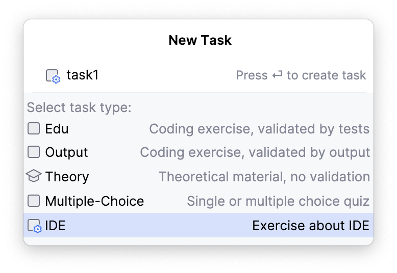
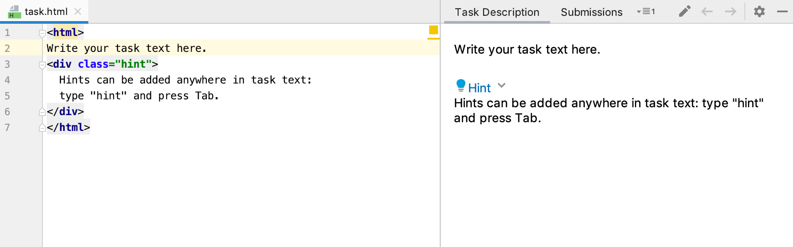

# Руководство по созданию курсов
При помощи плагина JetBrains Academy вы можете изучать и преподавать языки программирования
в виде заданий по кодированию и пользовательских проверочных тестов прямо в среде JetBrains IDE.

Плагин JetBrains Academy бесплатен для использования и поддерживает языки
**Java**, **Kotlin**, **Python**, **Scala**, **JavaScript**, **Rust**, **C++**, **Go**, **PHP**, а также другие языки.

## Выберите язык программирования
Это руководство поможет вам создать простой курс по **Java** с набором задач по программированию и интеграционными
тестами. Вы можете переключиться на другой язык программирования с помощью выпадающего меню **Section**
в правой верхней части страницы:


## Необходимая предварительная подготовка
Вы можете работать с курсами Java в Intellij IDEA, установив плагин JetBrains Academy.

Ознакомьтесь с нашим руководством [по установке](Installation/installation-guide.md), если у вас уже есть
[Intellij IDEA Community или Ultimate](https://www.jetbrains.com/idea/download).

# Процесс создания курса

1. Чтобы создать новый курс, перейдите на вкладку **Learn** на **Welcome screen** экране, нажмите **New Course**
и в левом нижнем углу выберите **Create course...**:

Альтернативный способ, чтобы создать курс - перейти в меню **File | Learn and Teach | Create New Course.**
2. В открывшемся окне введите название курса и описание курса, выберите язык программирования,
настройте месторасположение курса и среду курса и нажмите на кнопку **Next**:

> [!TIP]
> Если для вашего курса требуется определенный плагин или плагины, вы можете указать их 
> в разделе **Settings | Build, Execution, Deployment | Required Plugins**.
3. По умолчанию язык курса - английский, но его можно изменить, поправив параметр _language_ в файле **course-info.yaml**
Начните вводить язык и выберите нужный из списка:

4. Каждый курс, созданный в вашей IDE, имеет структура списка уроков. 
Существуют два типа уроков: _simple lesson_ и _guided project_.

В _simple lesson_ уроках учащиеся будут работать над набором независимых задач, чтобы изучить определенную тему.

В _guided project_ уроках учащиеся будут работать над одним проектом,
постепенно совершенствуя его с помощью серии взаимосвязанных задач.

Выберите первый тип урока и нажмите на кнопку **Create course**:

> [!TIP]
> В этом руководстве мы будем работать в основном с простыми уроками. Если вы заинтересованы в создании _guided project_
> уроков, вы можете ознакомиться со статьей [Guided project](./guided-project.md).

## Виды заданий
> [!TIP]
> В открывшемся окне вы увидите основные окна инструментов, используемых для навигации:
> _Course view_, _Editor_, _Task Description_:
> 
> Вы можете ознакомить с 
> [экскурсией по пользовательскому интерфейсу плагина JetBrains Academy](../../guided-tour-around-ui.md), 
> которая поможет вам сделать первые шаги в работе с плагином.

Каждый урок содержит задания. Существует пять типов заданий:
* **Edu** - упражнение по кодированию, покрытое тестами;
* **Output** - упражнение по кодированию, подтверждаемое корректностью результат вывода;
* **Theory** - теоретический учебный материал без проверки;
* **Multiple-choice** - тест с одним или несколькими вариантами ответов;
* **IDE** - задание, помогающее изучить функциональность IDE.

Давайте рассмотрим каждый тип подробнее:
> [!NOTE]  
> **Edu** - это самый распространенный тип заданий в наших курсах.
> Его конструкция довольно проста: есть файлы задания, 
> которые нужно изменить, и тестовые файлы, которые проверяют написанный код.
> Чтобы создать новое задание **Edu**, необходимо перейти в меню **File | New | Task** 
> или щелкнуть правой кнопкой мыши **lesson** и выбрать **New | Task**, а затем выбрать **Edu** в списке:
> 
> 
> В задания тип Edu можно поручить кнопке "**Check**" выполнение пользовательских команд.
> Для этого необходимо выполнить следующие действия:
> * Создайте новую конфигурацию запуска, перейдя в меню **Run | Edit Configurations...**;
> * Выберите шаблон из списка, если он необходим;
> * Отметьте опцию **Store as project file** и сохраните конфигурацию запуска в 
> `task_name/runConfigurations`.
> 
> Теперь при нажатии кнопки **Check** будет выполнена пользовательская конфигурация запуска, а также проверка тестами.

> [!NOTE] 
> **Output** - это тип заданий, который позволяет не писать тесты для простых задач, а проверять код обучаемого, 
> предоставляя ожидаемый вывод.
> У нас есть файл задачи, в который нужно записать код, файл input.txt,
> в котором можно задать конкретный входной параметр, и файл output.txt,
> в котором предопределен желаемый результат выполнения.
> > Наличие файла input.txt в задачах типа _Output_ не обязательно, поэтому вы можете удалить его,
> > если он не соответствует задаче.
> Чтобы создать новую задачу типа **Output**, перейдите в меню **File | New | Task** или
> выберите правой кнопкой мыши свой урок, и нажмите на **New | Task** и выберите в списке пункт **Output**:
> 

> [!NOTE] 
> **Theory**: Очень важно соблюдать баланс между практическими и теоретическими заданиями.
> Именно поэтому мы придумали идею заданий типа _Theory_.
> В этих заданиях преподаватель дает обучающемуся учебный материал,
> который можно использовать для решения практических задач.
>
> Кроме того, поскольку в них нет проверки, ученик может отрабатывать свои навыки кодирования в **Editor** зоне.
> Они даже могут скомпилировать и запустить программу, нажав на кнопку **Run** в левом нижнем углу зоны **Task Description**.
> У преподавателей также есть возможность предоставить учащимся примеры кода, которые можно запустить на выполнение,
> в качестве сопровождения к теории.
> 
> Чтобы создать новое задание типа **Theory**, перейдите в меню **File | New | Task** или выберите свой урок,
> нажмите на пункт **New | Task** выберите в списке пункт **Theory**:\
> 
> В теоретических задачах можно указать кнопке **Run** выполнять пользовательские команды.
> Для этого выполните следующие действия:
> * Создайте новую конфигурацию запуска, перейдя в меню **Run | Edit Configurations...**;
> * Выберите шаблон из списка, если он необходим;
> * Отметьте опцию **Store as project file** и сохраните конфигурацию запуска в каталоге **task_name/runConfigurations**.
> 
> Теперь при нажатии  кнопки **Run** будет выполнена ваша пользовательская конфигурация запуска.

> [!NOTE]
> **Multiple-Choice**: вопросы в заданиях такого типа имеют множественный выбор, и на них можно выбрать как один,
> так и несколько ответов. Каждый тест состоит из вопроса и возможных ответов.
> Эти параметры задаются в файле **task-info.yaml**. Вот пример такого файла:
> ```yaml
> type: choice
> is_multiple_choice: false
> options:
> - text: Correct
>   is_correct: true
> - text: Incorrect
>   is_correct: false
>   message_correct: Congratulations!
>   message_incorrect: Incorrect solution
>   files:
> - name: src/Main.java
>   visible: true
> ```
> Наиболее важными параметрами здесь являются **is_multiple_choice**, **options**, **message_correct** и **message_incorrect**.
> Чтобы создать новое задание типа **Multiple-choice**,
> перейдите в меню **File | New | Task**  или щелкните правой кнопкой мыши урок, выберите **New | Task**
> и в списке выберите **Multiple-choice**:
> 

> [!NOTE]
> **IDE**: По своей структуре задания IDE похожи на теоретические задания.
> 
> Эти задания предполагают, что преподаватель обучает учащихся взаимодействию с IDE. Обратите внимание,
> что для таких заданий нет проверки.
> 
> Например, эти задания могут содержать информацию об описании полезных функций IDE,
> настройке IDE или наиболее удобных сочетаниях клавиш.
> > В описании задачи можно вставит ярлыки. Когда файл **task.html/task.md** открыт,
> >щелкните правой кнопкой мыши в любом месте представления редактора и выберите в контекстном меню пункт **Insert shortcut**.
> 
> Чтобы создать новое задание типа **Multiple-choice**,
> перейдите в меню **File | New | Task**  или щелкните правой кнопкой мыши урок, выберите **New | Task**
> и в списке выберите **IDE**:
> 

## Структура заданий
1. Как правило, задание состоит из следующих компонентов:
   * файл описания task.html;
   * файл Task.java с кодом упражнения;
   * файл Test.java с проверкой задания;
   * любые другие файлы, необходимые учащемуся для выполнения задания.
> [!TIP]
> Вы можете пометить файлы в вашем курсе, как нередактируемые, чтобы ваши ученики не могли вносить в них изменения.
> Откройте файл task-info.yaml и установить параметр _editable_ в значение _**false**_.

Перейдите в меню **View | Tool Windows | Project** или используйте `Alt` `1`, чтобы посмотреть структуру курса:

2. Добавляйте новые уроки, задания ли группируйте уроки в разделы с помощью меню **File Menu | New**, 
перетаскивайте элементы, чтобы изменить их порядок.
Чтобы переименовать элементы, щелкните их правой кнопкой мыши в меню и используйте команду **Refactor | Rename**
или вызовите `Shift` `F6`:

> [!TIP]
> Если вам нужны дополнительные файлы для задания, просто добавьте их и решите,
> сделать из видимыми для учеников или нет с помощью пунктов контекстного меню
> **Course Creator | Make Visible to Learner / Hide from Learner**.

## Работа с заданиями
1. Откройте файл **Task.java** и напишите код, необходимый для выполнения упражнения, например:
```java
class HelloJava {
  public static void main(String[] args) {
    System.out.println(sayHello());
  }

  private static String sayHello(){
    return "Hello, Java!";
  }
}
```

2. Выберите пункт **Run** в контекстном меню или нажмите `Shift` `F10`, чтобы запустить ваш код и проверить,
работает ли он так, как ожидалось:

3. Когда код будет готов, выберите фрагмент, которые хотите, чтобы ученик заполнил, вызовите команду **Add Answer Placeholder**
из контекстного меню и добавьте текст заполнитель:

Если вы добавляете заполнитель к следующей задаче, вы можете создать зависимость между этими двумя заполнителями:

4. Если вы хотите посмотреть, как ваше задание будет выглядеть для ученика, щелкните правой кнопкой мыши файл **Task.java**
в каталоге **src** и выберите **Course Creator | Preview Task File:**

5. Теперь пришло время добавить описание задачи. Нажмите на значок **Edit** в верхней части панели описания задачи
или просто откройте файл task.html.
6. Добавьте несколько подсказок, чтобы помочь ученику найти правильное решение. 
Подсказки следует добавлять в пустую строку в тексте задания. Чтобы добавить подсказку, введите "_hint_" и нажмите `Tab`.
> [!TIP]
> В подсказках вы можете использовать как HTML, так и Markdown.
7. Вам может понадобиться направить учащихся к определенному уроку, заданию, или файлу,
чтобы помочь им в работе с помощью ссылок в курсе:

Чтобы ускорить процесс выбора путей для внутрикурсовых ссылок, начните вводить имя пути в формате: 
`course://lesson1/task1/file1`.
Вы увидите список предложений, которые можно использовать для быстрого выбора пути к элементу,
на который нужно сделать ссылку. Нажмите `Ctrl` `Space`, чтобы вызвать список предложений.
8. Вы можете добавлять изображения и видео к описанию задачи, используя соответствующую разметку в HTML/Markdown.
Вы даже можете проучить плагину отображать отдельный набор скриншотов и видел для темной темы IDE.
> [!NOTE]
> Для локальных изображений достаточно добавить к их именам суффикс **_dark**.
> Например, у нас есть изображение **screenshot.png**, оно будет использоваться со светлой темой,
> если мы поместим в ту же директорию изображение **screenshot_dark.png**,
> оно будет автоматически использоваться с темной темой.

> [!NOTE]
> Для удаленных изображений необходимо указывать путь в атрибуте **data-dark-src** следующим образом:
> `src="https://light.png" data-dark-src="https://dark.png"/>`

> [!NOTE]
> Для видео необходимо указывать путь в атрибуте **data-dark-src** следующим образом:
> `<iframe src="https://www.youtube.com/embed/light_video" data-dark-src="https://www.youtube.com/embed/dark_video"></iframe>`
9. Просматривайте все изменения на панели описания задач (**Task Description**) во время редактирования.

> [!NOTE]
> Описание задачи поддерживает HTML и Markdown, переименуйте **task.html** в **task.md**, если вы предпочитаете Markdown.
> Чтобы изменить формат описания задачи по-умолчанию, перейдите в **Settings | Tools | Education | Course creator**.

## Написание тестов
1. Вы можете написать свои собственные тесты, чтобы автоматически проверять решение ученика. В каталоге test/tests каждой
задачи есть файл Test.java, который вам нужно будет изменить:

2. Давайте заменим содержимое тестового файла на следующее:
> [!TIP]
> Вам нужно будет переименовать файл **Test.java** в **HelloJavaTest.java** и сделать метод **sayHello** публичным (**public**).
```java
import org.junit.Test;
    import static org.junit.Assert.*;

public class HelloJavaTest {

  @Test
  public void testSolution() {
    assertEquals("You should say hello to Java",
            "Hello, Java!", HelloJava.sayHello());
  }
}
```
3. Чтобы проверитьЮ что ваш код проходит тесты, нажмите на кнопку **Check** в нижней части панели **Task Description**.
Если ваш код и тесты верны, вы увидите сообщение **Correct**:

> [!TIP]
> Вместо того, чтобы просматривать каждое задание по одному, вы можете проверить их все сразу
> или запустить проверку выбранных заданий, перейдя в меню **File | Course Creator | Check Selected Tasks**.

## Предварительный просмотр курса
1. Когда вы закончили создание курса, неплохо было бы просмотреть его с точки зрения ученика и протестировать.
Щелкните правой кнопкой мыши на панели курса и перейдите в меню **Course Creator | Create Course Preview**, 
чтобы открыть курс в режиме ученика:

2. Так вы можете проверить структуру курса:

3. Решите задачи и проверьте корректность пройденных проверок:

4. Проверьте подсказки и ссылки, имеющиеся в описании задания:

5. Проверьте правильность ответа:

> [!TIP]
> Вы можете отключить опцию **Peek Solution** для вашего курса, добавив параметр "**solutions_hidden**: true" в файл **course-info.yaml**.
> Или вы можете отключить ее для конкретного задания, добавив параметр "**solutions_hidden**: true" в файл, **task-info.yaml**.
> См. [руководство по формату YAML](../../introducing-yaml-format.md).

## Распространение курса
* У вас есть несколько вариантов распространения вашего курса.
Вы можете загрузить его в [Marketplace](https://plugins.jetbrains.com/) репозиторий плагинов и курсов, 
опубликовать его на [GitHub](https://github.com/) или распространять локально, экспортировать его в архив.

Давайте рассмотрим эти варианты подробнее:
> [!NOTE]
> **Marketplace**: перед загрузкой курса на маркетплейс вы можете изменить его описание и другую информацию.
> Перейдите в меню **File | Course Creator | Edit Course Information** и измените параметры в файле **course-info.yaml**:
> 
> Параметр **vendor** является дополнительным и должен быть заполнен только в том случае,
> если автор курса является представителем данной организации.
> 
> Чтобы загрузить свои курсы в Marketplace, вам сначала нужно открыть учетную запись.
> Заполните эту [форму](https://account.jetbrains.com/login),
> чтобы создать новую учетную запись JetBrains или [войдите](https://plugins.jetbrains.com/developers/marketplace) в нее,
> используя существующую учетную запись Google, GitHub, или BitBucket.
> 
> После регистрации откройте свою IDE, перейдите в радел **Settings | Tools | Education | Marketplace**
> и нажмите **Log in to Marketplace**. В браузере появится страница авторизации. После авторизации вернитесь в IDE.
> > Если вы не хотите загружать все файлы курса в Marketplace, вы можете создать файл **.courseignore**
> > в корне вашего проекта и перечислить в нем все файлы, которые нужно игнорировать.
> 
> Перейдите в меню **File | Course Creator** и выберите опцию **Upload Course to Marketplace**, чтобы загрузить свой курс:
> 
> Одобрение курса нашими модераторами замет 2-3 дня.
> В это время курс не будет виден в диалоге **Select Course** и не сможет быть обновлен.
> Вы получите по электронной почте уведомление, как только курс будет одобрен.
> 
> После того, как курс будет утвержден, вы сможете внести в него последние изменения, перейдя в меню **File | Course Creator** 
> и выбрав Update Course on Marketplace.
> 
> О том, как управлять курсами в Marketplace, читайте в этом [руководстве](../JetBrains%20Marketplace/course-ar-marketplace.md). 

> [!NOTE]
> **GitHub**: Чтобы загрузить свои курсы на GitHub, вам сначала понадобится учетная запись GitHub. Заполните эту
> [форму](https://github.com/), чтобы создать новую учетную запись GitHub.
> 
> После регистрации откройте IDE, перейдите в раздел **Settings | Version Control | GitHub** и нажмите **Add Account…**.
> 
> После этого перейдите в меню **VCS**, выберите **Enable Version Control Integration…**, выберите **Git** и нажмите **OK**.
> 
> Теперь перейдите в раздел **VCS | Import into Version Control** и выберите **Share Project on GitHub**:
> 
> Готово! Ваш курс был опубликован на GitHub.

> [!NOTE]
> **Локальное распространение**: чтобы сохранить локальный доступ к своему курсу, перейдите в меню **File | Course Creator**
> и выберите **Create Course Archive**:
> 
> > Если вы не хотите загружать все файлы курса в Marketplace, вы можете создать файл **.courseignore**
> > в корне вашего проекта и перечислить в нем все файлы, которые нужно игнорировать.
> 
> Теперь у вас есть zip-архив, которым вы можете поделиться со своими учениками.
> 
> Чтобы импортировать курс на **Welcome screen** экране IDE, перейдите на вкладку **My Courses** и выберите **Open Course from Disk**.
> Также вы можете получить доступ у этой опции, перейдя в меню  **File | Learn and Teach | Browse Courses**,
> переключившись на вкладку **My Courses** и нажав **Open Course from Disk...**.