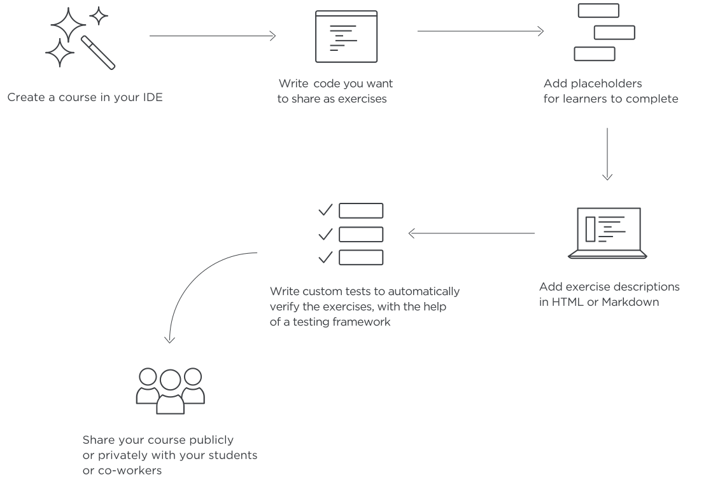
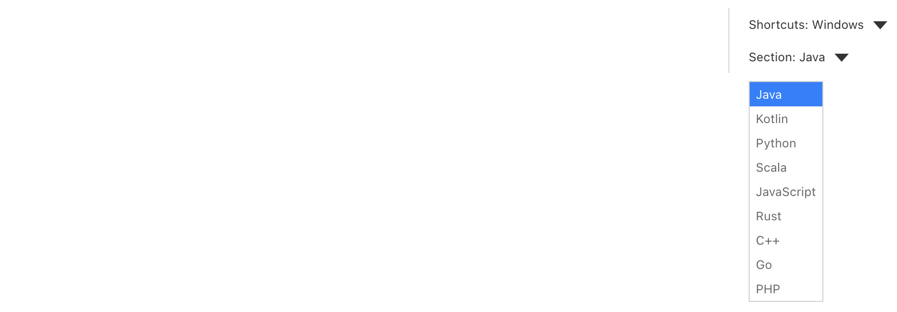

# Информация для преподавателей (создателей курсов)

Вы можете поделиться своими знаниями в виде заданий по кодированию и пользовательских проверочных тестов.

## Выберите язык программирования
Это руководство поможет вам создать простой курс по **Java** с набором задач по программированию и интеграционными
тестами. Вы можете переключиться на другой язык программирования с помощью выпадающего меню **Section**
в правой верхней части страницы:

**Для получения более подробной информации ознакомьтесь с
[руководством по созданию курса](./Course%20creator%20start%20guide/course-creator-start-guide.md).**